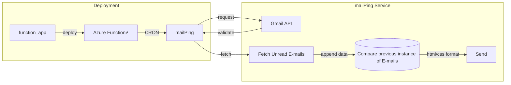

# MailPing

| Phase | Date |
| :--- | :--- |
| Project Started | Jan '24 |
| Project Ended | Jan '24 |
| Documentation Updated | May '26 |

## Introduction

A Gmail notifier that monitors inboxes for new unread emails and sends you a formatted HTML digest when detected. Basically fetches all unread emails from your Gmail account and compares them against the previous run's snapshot (`outputDiff.txt`). If there are any new or removed unread emails, it sends a summary table to your nominated address.

## Prerequisites

- Python 3.x
- A Google Cloud project with the Gmail API enabled
- OAuth2 credentials (credentials.json) downloaded from the Google Cloud Console
- Azure Functions for CRON capabilities

## Architectural Overview

